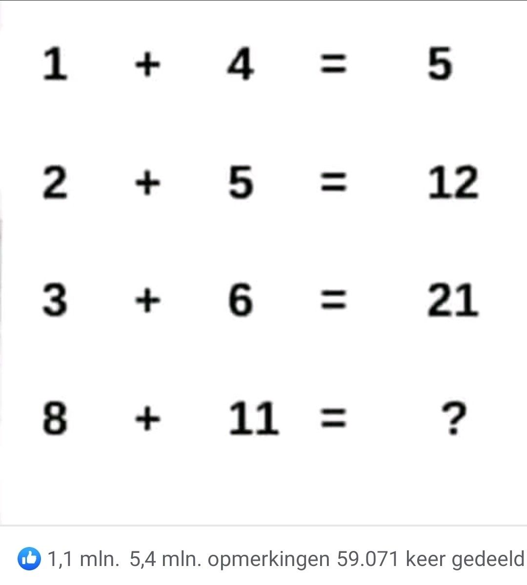

# 8 July 2023

The picture below is the "challenge" that I saw on [LinkedIn](https://www.linkedin.com/), for which I decided to write a program.

## Multiple right answers
As far as I have been able to see, there are at least 2 possible solutions to this puzzle.

1. Viewing each line on its own, you would consider the answer to that line to be the left side multiplied and added to the value left of +
So that would mean to get from 1 + 4 = 5 is myltiplying 1 and 4, being 4 and adding 1, making the anser 5.
The same goes for 2 + 5 = 12: 2*5= 10, 10+2=12

2.  A second solution might be that the outcome after =, is increased with the sum of the values on the left side.
What this means is that the first line, 1+5=5. Coming from the previous value of 0, the answer is 5. The next line (2+5=12) comes down to adding 2+5 to 5 -> 7+5=12

## My take on this
For now, I will concentrate on the first option of solving the puzzle.
The first 3 lines are given:
1. 1 + 4 = 5
2. 2 + 5 = 12
3. 3 + 6 = 21
8. 8 + 11 = ?

### Let's turn that into variables

'a = 1, b = 4'
